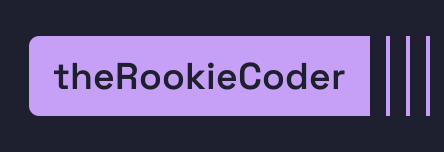
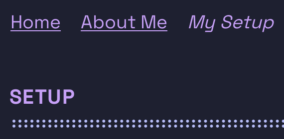

+++
title = "Creating this Website"
date = "2025-03-23"
author = "theRookieCoder"
tags = ["markdown", "html", "css", "hugo"]
description = "I think a website is an important part of your online image --- it is a blank canvas for you to showcase yourself and your thoughts. I finally got around to creating a personal website last month, so here is how I made it."
+++

As a developer and person on the internet, I think a website is an important part of your image --- it is a blank canvas for you to showcase yourself and your thoughts. I had been looking to make a personal website for a while, but the inspiration never struck. But I finally got around to it last month, and I want to talk about how I made it.

# Philosophy

Websites are an integral part of the internet, and as the internet grew, websites did too. This has led to an explosion in the scale of websites. Browsers nowadays are like mini operating systems, and the technologies available to create websites are numerous and complex.

But when creating my website, I wanted to something simple to share my thoughts. I had to take a step back, and realise that it doesn't take much to make a good looking website; some simple CSS can go a long way. I came across https://motherfuckingwebsite.com, and the following lines really resounded with me.

> "... all the problems we have with websites are ones we create ourselves. Websites aren't broken by default, they are functional, high-performing, and accessible. You break them."

> "Good design is as little design as possible"
> 
> &horbar; [Dieter Rams](https://www.vitsoe.com/rw/about/good-design#id-good-design-is-as-little-design-as-possible)

# Technology

Choosing a minimalist philosophy, I decided to create a simple static website. No UI frameworks, no JavaScript, no server-side rendering, just plain old HTML and CSS. But creating a website from scratch is quite painful, so I searched for static site generators that fit my use-case.

One of my requirements was using Markdown --- it really is one of my favourite aspects of computers. I love its simplicity and versatility, and I think it's the perfect tool for writing content on the web.

I discovered [Hugo](https://gohugo.io), its idea is simple; you select a theme, write content in Markdown, and with one command Hugo will build your website in milliseconds. It even supports hot reloading! I explored the recommended themes, and found the [Terminal](https://themes.gohugo.io/themes/hugo-theme-terminal) theme to be good looking, and appropriate for me too! But of course, I had to customise it to my heart's content.

# Theming

The most important part of theming is colours. I like using the [Catppuccin](https://catppuccin.com) Macchiato theme, so I decided to use it here. Fonts are also really important, most of what you see here is text after all. I decided to use 3 of my favourite fonts ---
[Space Grotesk](https://fonts.floriankarsten.com/space-grotesk) in the header, footer, and headings;
[JetBrains Mono](https://www.jetbrains.com/lp/mono) for code; and
[Atkinson Hyperlegible](https://www.brailleinstitute.org/freefont) for other elements and body text.

# Customisation

At first, I used the Terminal theme directly. But I wanted to make some modifications to it, so I copied over the styles and layouts to my project. I removed components of the theme that I didn't use --- such as the comments, the language selector, Twitter embeds, custom syntax highlighting (Hugo's built-in version worked well for me), and more.

I ended up making a ton of changes, so I only listed some notable ones here. You can see all the changes on the repository's [commit history](https://github.com/theRookieCoder/theRookieCoder.github.io/commits).

- Open all external links in a new tab. I personally hate it when I'm reading something on a website and the link replaces the tab I was reading on.

- Round the logo in the header, and pad it better.
  

- Don't link to the current page in the header and menu, instead italicise the text.
  

- Make the header sticky, i.e. it stays at the top of the screen even after you scroll.

- To account for the sticky header, I added the `scroll-margin` property to headings so that when opening anchor links (links that automatically scroll to a heading) the browser won't hide the heading underneath the header. I've seen a lot of website that have this issue.

- Combine all CSS styles into a single file. I noticed on [PageSpeed Insights](https://pagespeed.web.dev) that a significant portion of network time was spent on fetching the numerous stylesheets.

- Make the table of contents collapsible.

# Conclusion

Well after more than 50 commits tweaking various aspects of the website, am I happy? I am! One small nitpick I have is that there is a [tiny amount of JavaScript](https://github.com/theRookieCoder/theRookieCoder.github.io/blob/main/assets/js/menu.js) for controlling the menu, but to my knowledge it is not possible to make a clickable hover dropdown menu in pure HTML and CSS. I'm still really satisfied with how my website turned out, and I love that I finally have a platform to share my thoughts on. I hope you have fun reading my content here!
